# Throttle-Gate — Rate Limiting Visualizer

An interactive web app that demonstrates and **visualizes** the five classic
rate-limiting algorithms in real time. A configurable load generator fires a
continuous stream of requests at a rate limiter; the limiter decides **allow** or
**reject** per request; every decision — and the limiter's *internal state* at
that moment — is streamed live (SSE) to a browser visualizer.

The point is **seeing the algorithm think**: watching the token jar drain, the
leaky bucket overflow, the fixed-window counter spike across a boundary — and a
side-by-side **comparison mode** that runs one identical request stream through
multiple algorithms at once, so the behavioral differences are obvious rather
than theoretical.

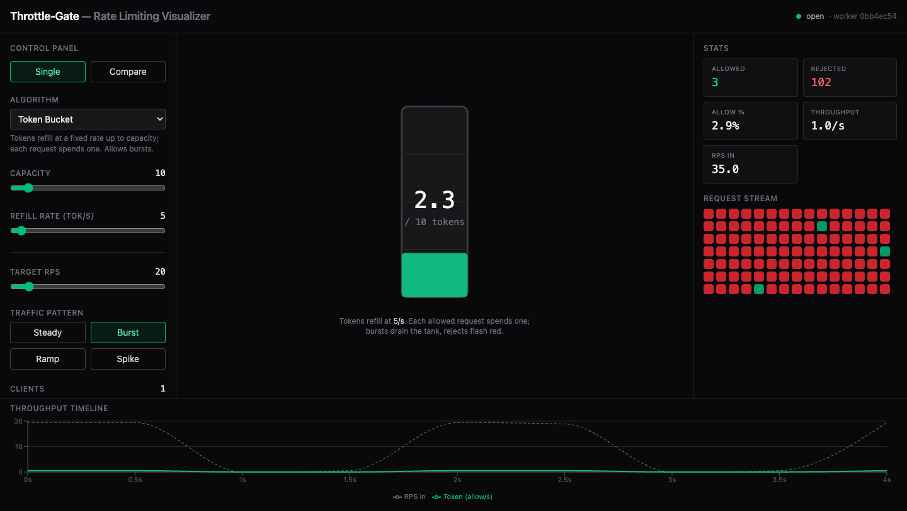

## Features

- **Seven algorithms**, each with a purpose-built animated visualizer:
  Token Bucket, Leaky Bucket, Fixed Window Counter, Sliding Window Log, Sliding
  Window Counter, **GCRA** (leaky bucket as a meter), and a **Concurrency**
  limiter (caps in-flight, not rate).
- **Atomic** state updates — every read-modify-write runs as a single Redis Lua
  script (`EVALSHA`), so concurrent requests never over-admit. Proven by a load
  test ([`test_concurrency.py`](backend/app/tests/test_concurrency.py)).
- **Live SSE stream** of per-request decisions + ~500ms aggregate stats, with
  rAF-coalesced rendering that sustains high RPS without thrashing React.
- **Comparison mode** — the *same* request (same `request_id`/`ts`) evaluated
  across multiple algorithms simultaneously, with side-by-side visualizers and a
  throughput-over-time overlay.
- **Distributed mode** — the headline lesson: local (unshared) per-replica state
  breaches the global limit (~N×) while shared Redis state holds it. Demonstrated
  both live in-app and across two real backend replicas behind nginx.
- **Live mode** — put it in front of a real service: a `POST /v1/check` decision
  API + a FastAPI middleware adapter rate-limit real traffic and stream every
  decision into the same dashboard. See [Live mode](#live-mode--rate-limit-your-real-traffic).
- **Traffic patterns**: steady, burst, ramp, spike. **Per-client keying** with up
  to 8 simulated clients. **Request Inspector** showing the full HTTP picture
  (status, `Retry-After`, simulated `X-RateLimit-*` headers, latency, raw state).

## The algorithms

| Algorithm | Core idea | Visualization |
|---|---|---|
| **Token Bucket** | Tokens refill at a fixed rate up to capacity; each request spends one. Allows bursts. | Vertical tank; level drips up at the refill rate, drops per allowed request, flashes on reject. |
| **Leaky Bucket** | Requests queue and drain at a constant rate; overflow rejected. Smooths output. | Funnel of stacked drops leaking steadily; overflow bounces off the top. |
| **Fixed Window** | Count requests per fixed time bucket; reset on the boundary. | Filling bar + reset countdown ring + a **boundary-burst** warning when adjacent windows both max out. |
| **Sliding Window Log** | Store timestamps; count those within the trailing window. | Dots on a trailing time axis that age leftward and drop off as they leave the window. |
| **Sliding Window Counter** | Weighted blend of current + previous fixed window. | Two window bars + a gliding estimate marker showing the smoothing. |
| **GCRA** | Leaky bucket as a *meter*: one timestamp (TAT) enforces a smooth rate with a burst allowance. | A meter that fills a slot per allowed request and drains at the rate; rejects at the burst ceiling. |
| **Concurrency** | Caps simultaneous in-flight requests (not a rate). Each request leases a slot for up to its hold time; slots auto-release on expiry. | A grid of `limit` slots filling with active leases; full budget flashes red. |

## Comparison mode

One `burst` run, three algorithms, same input — Token Bucket absorbs the burst
while Leaky and Fixed diverge, all at once:

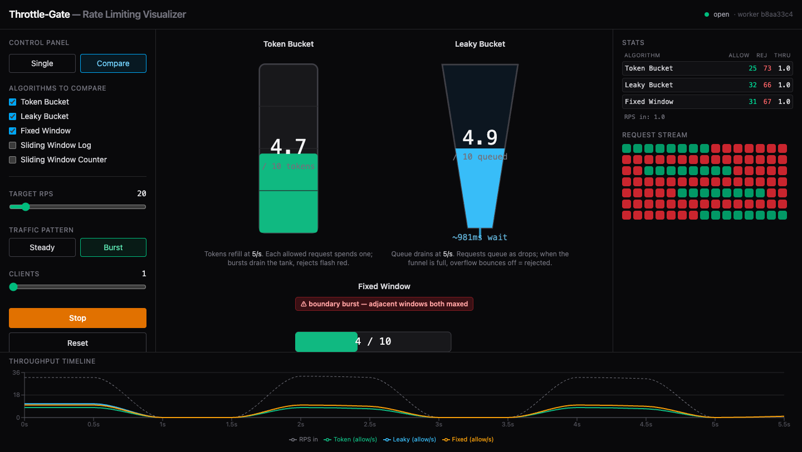

## Distributed mode — why shared state matters

The strongest talking point. With **local** (in-memory, per-replica) state, each
replica enforces the limit independently, so round-robined traffic admits ~N× the
configured global limit — the limit is **breached**. With **shared** Redis state
and atomic Lua, the global limit **holds** regardless of which replica handles a
request.

| Local memory — breached (~2×) | Shared Redis — holds |
|---|---|
| 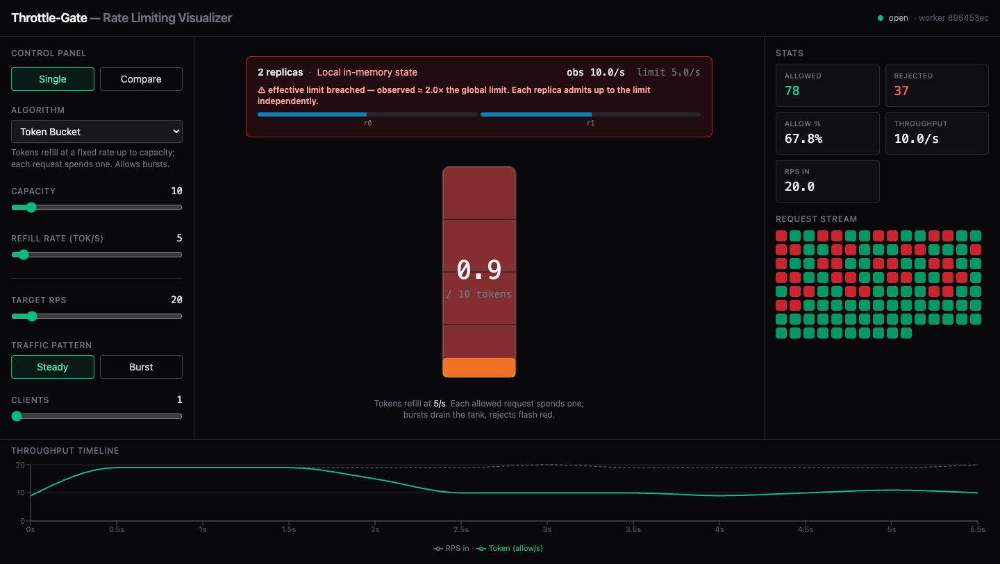 | 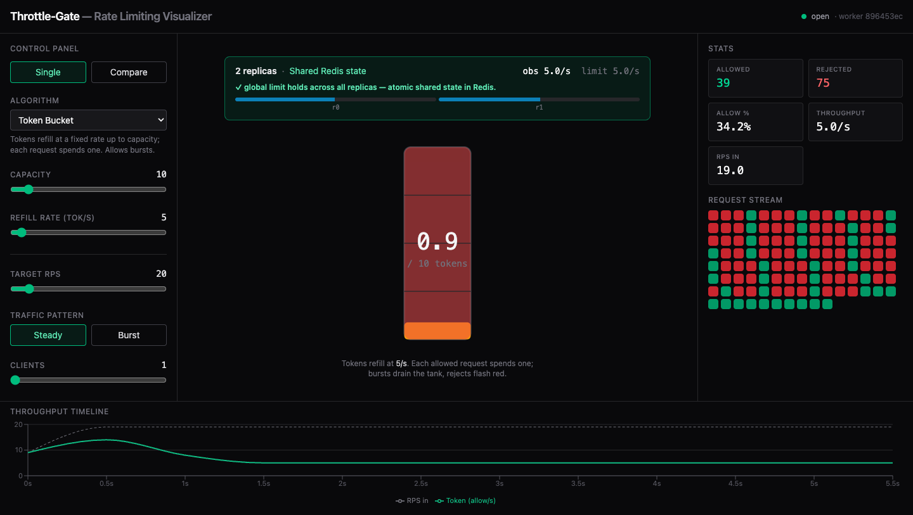 |

This is demonstrated two ways:
1. **Live in-app** — toggle local/shared and watch the observed allow-rate vs the
   configured limit, with a breach callout.
2. **Real replicas** — `docker-compose.distributed.yml` runs two backend replicas
   behind nginx; [`scripts/distributed_demo.py`](scripts/distributed_demo.py)
   load-tests the protected `/api/gate` endpoint through the proxy:

   ```
   shared  mode:  20/100 admitted   replicas={88eb17ef: 48, 42041ab7: 52}   ← holds
   local   mode:  40/100 admitted   replicas={88eb17ef: 50, 42041ab7: 50}   ← 2× breach
   ```

## Request Inspector

Click any request chip to see what a real rate-limited HTTP response looks like:

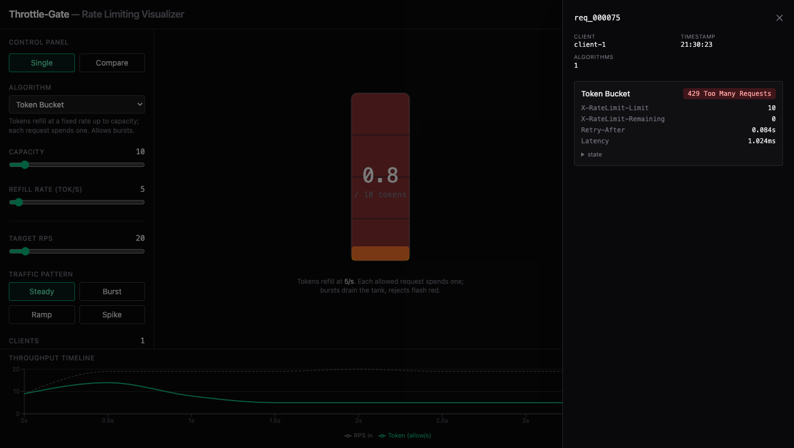

## Live mode — rate-limit your *real* traffic

Beyond the synthetic generator, Throttle-Gate can sit in front of a real service.
Switch the dashboard to **Live traffic**, point your server at the decision API,
and every real request flows through the same visualizers — you watch live what's
allowed vs. throttled, by key and by route.

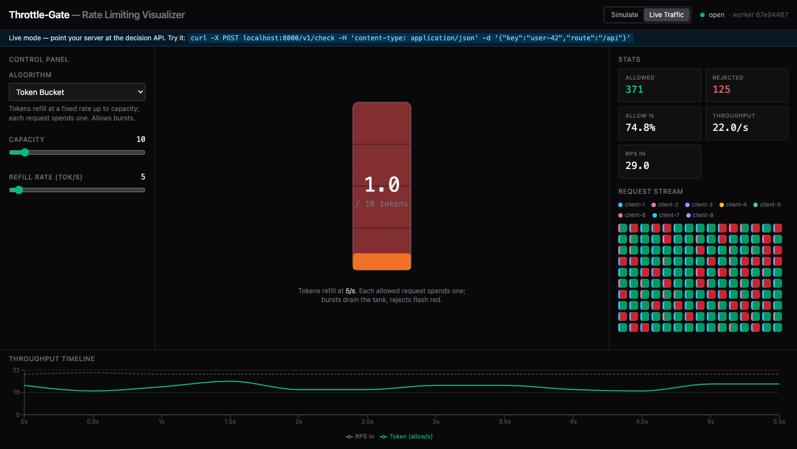

- **Decision API:** `POST /v1/check {key, route}` → `200` / `429` with real
  `Retry-After` and `X-RateLimit-*` headers. Tune the limiter (algorithm + limits)
  live from the dashboard.
- **Plug it in:** ready adapters for FastAPI, Express, nginx, Envoy, and
  Cloudflare Workers (see [`adapters/`](adapters/)), or run the whole thing next
  to your app with the [sidecar bundle](deploy/sidecar/).
- **Try it:**

  ```bash
  docker compose up -d                 # backend on :8000, UI on :5173
  python scripts/live_demo.py          # drive real traffic at /v1/check
  # …then switch the dashboard to "Live traffic"
  ```

The inspector shows each real request's key, **route**, **cost**, and the exact
headers a client would receive:

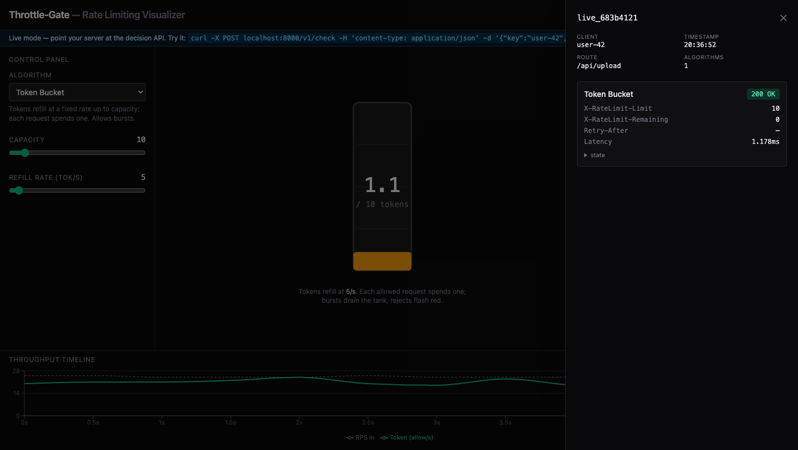

## Policies — per-route / per-key rules

One global limit is rarely enough. A **policy** is an ordered list of rules
(`PUT /v1/policy`); for each request the **first matching rule wins**, choosing
the algorithm, params, and cost — or hard-denying it. Unmatched traffic uses the
dashboard's default limiter. Each rule keeps its own state, so `/login` and
`/search` never share a bucket.

```bash
curl -X PUT localhost:8000/v1/policy -H 'content-type: application/json' -d '{
  "rules": [
    {"name": "block-abuser", "match": {"keys": ["bad-actor"]}, "deny": true},
    {"name": "login",  "match": {"route": "/login", "methods": ["POST"]},
     "algorithm": "fixed_window", "params": {"limit": 5, "window_s": 60}},
    {"name": "uploads", "match": {"route": "/api/upload/*"},
     "algorithm": "token_bucket", "params": {"capacity": 100}, "cost": 10}
  ]}'
```

- **Cost-weighting** — a rule (or a `/v1/check` request) can charge `cost > 1`, so
  an expensive endpoint spends more of the budget. Supported by all five
  algorithms.
- **Deny lists** — `"deny": true` blocks matching requests with `403`; the
  adapters propagate it (they pass through only on `2xx`).
- **Per-key burst overrides** — `"overrides": {"vip-1": 3}` gives a key a multiple
  of the matched limit (e.g. 3× capacity) without writing a separate rule.

Or author them in the dashboard — the **Policies** drawer (Live mode) edits,
reorders, and saves rules and per-key overrides without touching the API:

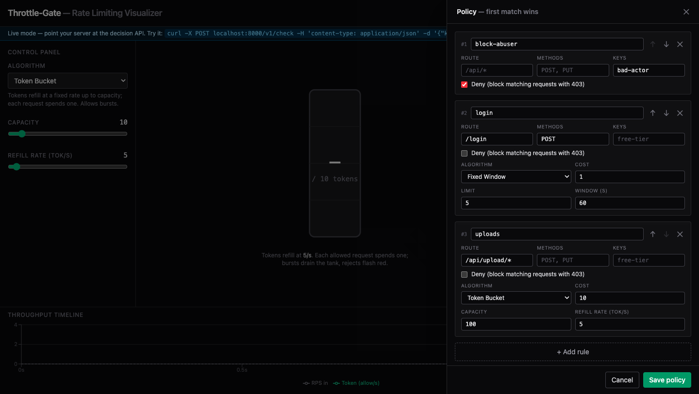

**Fail-open vs fail-closed:** if the limiter store (Redis) is unreachable, the
engine admits (degraded `200`) or rejects (`503`) per `GET/PUT /v1/settings`,
toggled live from the dashboard header — independent of each adapter's own
fail-open behavior.

## Observability

- **Prometheus** — `GET /metrics` exposes cumulative counters
  (`throttlegate_requests_total{algorithm,rule,decision}`,
  `throttlegate_cost_total`) for scraping into Grafana.
- **Top keys** — in Live mode the dashboard shows the top talkers and who's being
  throttled (per-key allowed vs `429`), streamed over SSE:

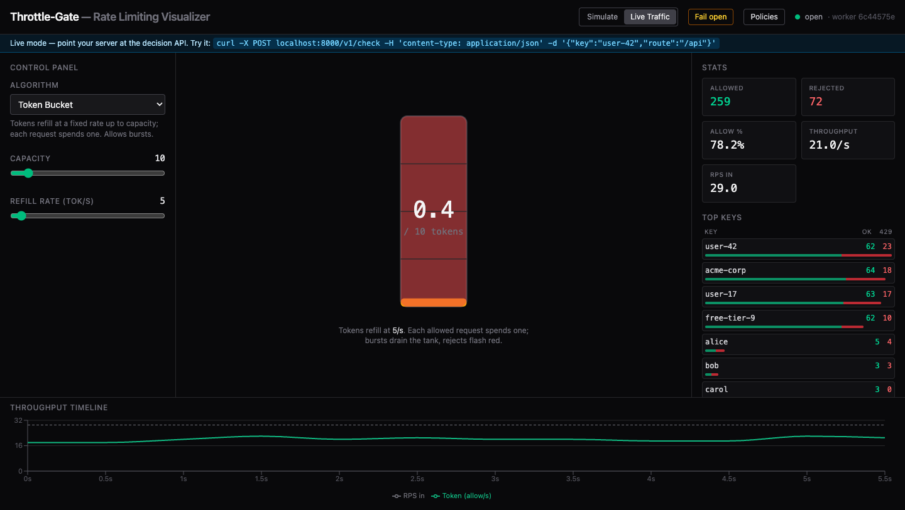

- **Traffic history** — the live gateway samples allowed/throttled every 5s into
  Redis (`GET /v1/history`), so the **Observability** drawer shows the last 30
  minutes — not just the live tail. History survives a backend restart.
- **Throttle alerts** — POST a webhook when one key is throttled past a threshold
  within a window (`GET/PUT /v1/alerts`); alerts also surface live as a dashboard
  toast.

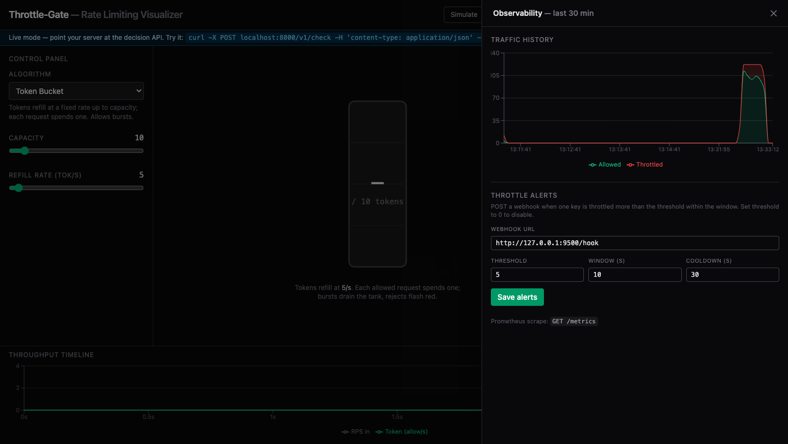

## Replay your own access log

The zero-deploy on-ramp: paste an nginx/Apache access log (or `key,route` CSV)
into the **Replay log** drawer and Throttle-Gate replays it through the algorithms
you pick — *at the original timestamps* — then shows what each would have allowed
vs. blocked, plus a burstiness-aware recommendation. No deployment, no live
traffic required (`POST /v1/replay`).

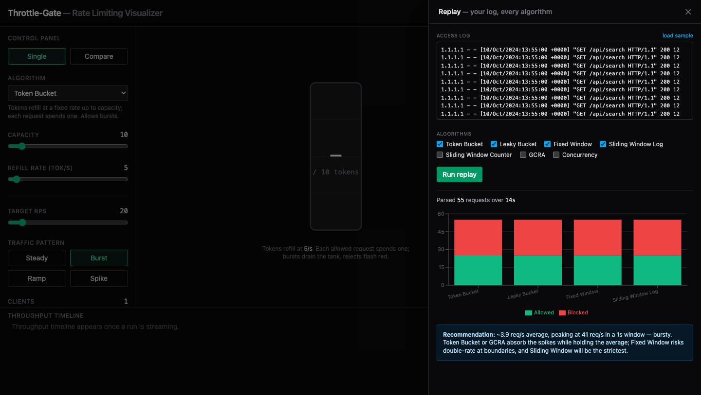

## Architecture

```
┌─────────────┐   SSE stream (decisions + state)   ┌──────────────────────┐
│   Browser   │ <───────────────────────────────── │   FastAPI backend     │
│  (React)    │                                     │   ┌─────────────────┐ │
│  Controls   │   REST: /session, /config           │   │ Load Generator  │ │
│  Visualizers│ ──────────────────────────────────> │   │ (asyncio task)  │ │
│  Compare    │                                     │   └────────┬────────┘ │
│  Timeline   │                                     │            ▼          │
└─────────────┘                                     │   ┌─────────────────┐ │
                                                     │   │ Limiter engine  │ │
                                                     │   │ (5 algorithms)  │ │
                                                     │   └────────┬────────┘ │
                                                     └────────────┼──────────┘
                                                                  │ atomic Lua
                                                                  ▼
                                                           ┌────────────┐
                                                           │   Redis    │
                                                           └────────────┘
```

## Tech stack

- **Backend:** Python 3.12, FastAPI, `redis.asyncio` (Lua via `register_script`),
  SSE, an asyncio load generator. Managed with `uv`.
- **Frontend:** React + Vite + TypeScript + Tailwind v4, Recharts for the
  timeline, custom SVG + `requestAnimationFrame` for the bespoke visualizers,
  native `EventSource` for SSE.
- **Infra:** Docker Compose (`frontend`, `backend`, `redis`); a distributed
  variant with two replicas + nginx.

## Run with Docker

```bash
docker compose up --build
```

- UI: http://localhost:5173
- API health: http://localhost:8000/api/healthz

## Run locally (without Docker)

Backend (needs Redis on `localhost:6379`, e.g. `docker run -p 6379:6379 redis:7-alpine`):

```bash
cd backend
uv run uvicorn app.main:app --reload --port 8000
```

Frontend:

```bash
cd frontend
npm install
npm run dev    # proxies /api → http://localhost:8000
```

## Distributed demo

```bash
docker compose -f docker-compose.distributed.yml up --build -d
python scripts/distributed_demo.py     # load-test through the proxy
```

## Tests

```bash
cd backend
uv run pytest        # includes the naive-vs-Lua over-admission concurrency test
```

## Project layout

```
backend/app/
  main.py            FastAPI app, control plane, SSE, /api/gate, /v1/check + /v1/authcheck (live)
  sse.py             SSE stream + session manager (incl. the live session)
  generator.py       asyncio load generator (steady/burst/ramp/spike)
  config.py          RunConfig + algorithm metadata
  stats.py           rolling aggregates
  ratelimit_headers.py  X-RateLimit-* derivation for /v1/check
  policy.py          per-route/key/method rules (cost, deny) for live traffic
  metrics.py         Prometheus /metrics counters for live traffic
  history.py         Redis-backed traffic time series (GET /v1/history)
  alerts.py          per-key throttle webhook alerting
  replay.py          access-log parse + replay through algorithms (POST /v1/replay)
  limiters/          one module per algorithm + Lua scripts
frontend/src/
  api/               REST control + EventSource wrapper
  state/             rAF-coalesced stream store
  components/        ControlPanel, RequestStream, Timeline, Inspector, visualizers/
adapters/            plug-in clients (FastAPI, Express, nginx, Envoy, Cloudflare)
deploy/sidecar/      run the engine + dashboard + redis next to your app
scripts/             distributed_demo.py, live_demo.py
docker-compose.yml             frontend + backend + redis
docker-compose.distributed.yml two replicas + nginx
```

See [`docs/throttle-gate_ROADMAP.md`](docs/throttle-gate_ROADMAP.md) for what's next (M7→M12).

Built as a portfolio / interview-prep project — optimized for clarity,
correctness, and visual explanation. See [`docs/throttle-gate_PRD.md`](docs/throttle-gate_PRD.md)
for the full spec.
